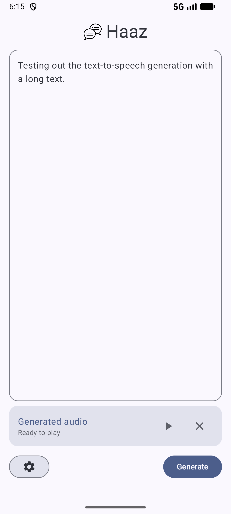
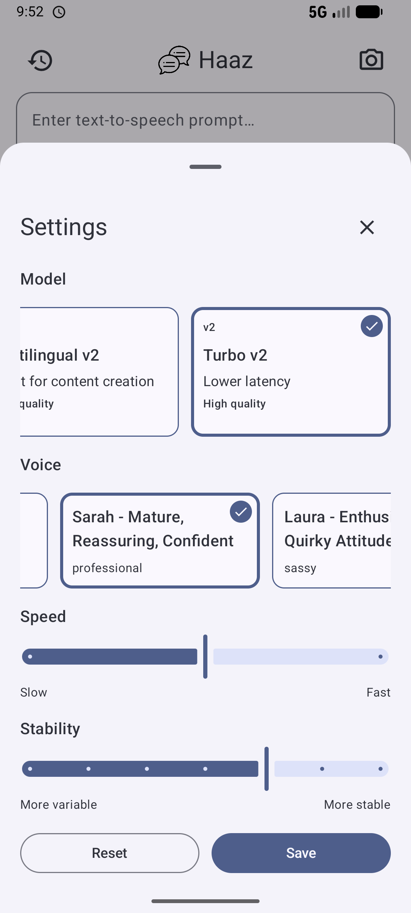
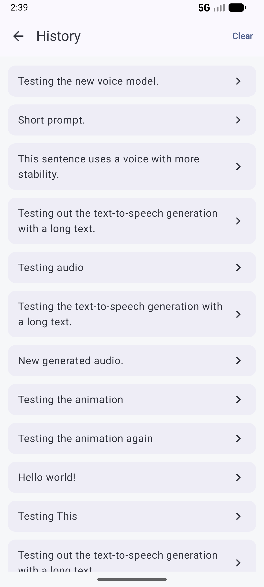
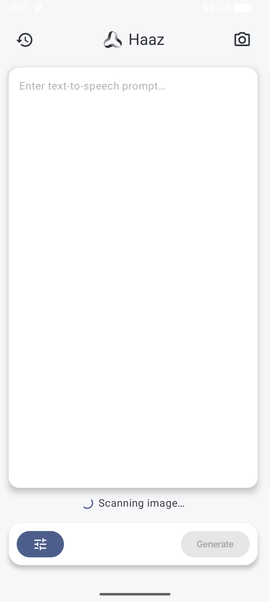

# Haaz Text-to-Speech App

## Overview
Haaz is an ElevenLabs-powered text-to-speech Android app built with Jetpack Compose. Users can:
- Enter prompts, generate audio, play the generated audio back from the home screen. 
- Open the settings sheet to configure the model, voice, speed and stability. 
- Open the history page to see their past prompts and select them to be used in the main text-to-speech generation flow.
- By clicking the camera button, open the camera, take a photo of the desired text and have the text from the image scanned as a prompt.

## Setup
1) Add your ElevenLabs API key to `local.properties`:
```
ELEVENLABS_API_KEY=your_api_key_here
```
2) Build/Run the app.

3) Open the app and enter text, then tap Generate.

## Tech Stack
- Kotlin, Jetpack Compose, Material3
- Hilt for dependency injection
- Retrofit/OkHttp
- [ElevenLabs TTS API](https://elevenlabs.io/docs/api-reference/text-to-speech/stream)
- Media3 ExoPlayer for playback
- DataStore for settings persistence
- MLKit for on device image-to-text detection

## Screenshots
| Home | Playback | Settings |
| --- | --- | --- |
|  |  |  |

| History | Image Scanning | E2E flow |
| --- | --- | --- |
|  |  |  |
